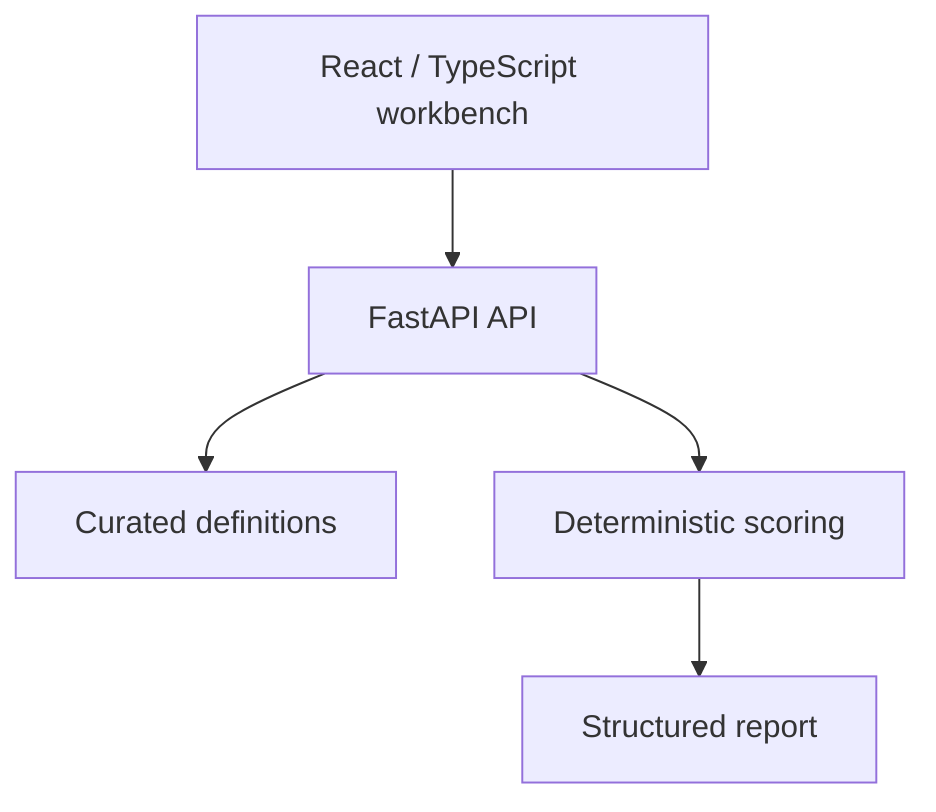
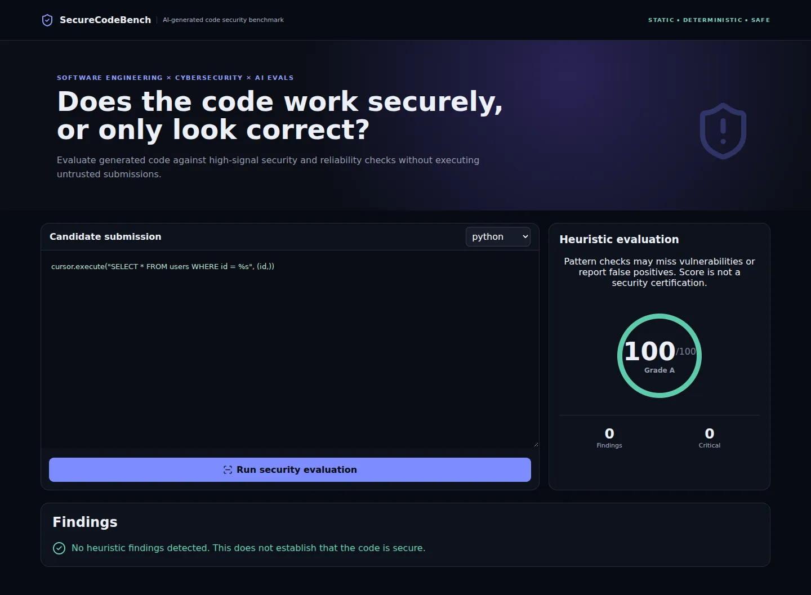

# SecureCodeBench

A safe static-pattern workbench for evaluating security and reliability risks in generated Python and JavaScript/TypeScript code.

[](https://github.com/yeabsira-mesfin/securecode-bench/actions)

**Demo status:** public hosting is pending account permissions. No live URL is claimed. Run the local demo below.

## Why this exists

AI-generated code may look plausible while missing authorization, using unsafe shell calls, or omitting request timeouts. Findings should identify the risk and explain a concrete remediation.

## Important features

- Ten curated rule categories: SQL injection, object authorization, hardcoded secrets, command injection, weak hashing, JWT verification, XSS, path traversal, unbounded uploads, and missing timeouts.
- Per-finding category, severity, penalty, rationale, and remediation guidance.
- Python, JavaScript, and TypeScript snippet inputs, bounded at 20,000 characters.
- Positive fixtures for every rule and safe negative fixtures.
- No code execution, outbound URL fetching, or repository cloning.

## Architecture

The React client calls a stateless scoring API. Curated task/rule definitions and score policies live in the backend. Production requests use the same-origin API by default; local development defaults to the backend port. No database, credential, or paid AI API is needed.



## Technology stack

React, TypeScript, Vite, Python 3.12, FastAPI, Pydantic, pytest, Docker, GitHub Actions.

## Evaluation methodology

Language-scoped regex/pattern rules emit at most one finding per rule. The score is `max(0, 100 - sum(finding weights))`. Severity affects the curated rule penalty; critical findings are counted separately. Grades are A ≥90, B ≥80, C ≥70, D ≥60, otherwise F.

This is **heuristic triage**, not an AST/data-flow analyzer or proof of security. It can flag benign uses (for example, sanitized HTML or a non-password MD5 checksum) and miss indirect data flows. A clean score means no configured patterns matched, not that code is secure. Test fixtures verify expected rule behavior, not model accuracy, precision, or real-world vulnerability coverage.

## Example

```python
query = f"SELECT * FROM users WHERE email = '{email}'"
cursor.execute(query)
```
The SQL rule emits a critical finding and recommends parameterized queries. Compare with `cursor.execute("SELECT * FROM users WHERE email = %s", (email,))`, which is a clean fixture.

## Security considerations

- Submitted content is treated as data. There is no `eval`, shell execution of submissions, arbitrary repository checkout, or candidate code execution.
- Requests are bounded and validated; UI requests time out and surface errors.
- APIs are public, stateless demonstration endpoints. CORS permits configured origins, but CORS is not authentication. Configure `ALLOWED_ORIGINS` as a comma-separated list of exact frontend origins for cross-origin hosting.
- No secrets are required. `VITE_` variables are public bundle contents; use `VITE_API_BASE_URL` only for an API URL.
- Do not submit private code, customer data, or real credentials. The application does not intentionally persist submissions, but hosting providers can retain request/access metadata.
- Hosting-level rate limits and abuse controls are needed before wider public traffic. Future executable evaluation must use disposable, isolated environments with resource limits, restricted networking, and no production credentials. The ordinary application Dockerfiles are not an untrusted-code sandbox.

## Project structure

```text
frontend/src/App.tsx       Snippet editor and findings
frontend/src/api.ts        Typed requests and timeouts
backend/app/rules.py       Ten language-scoped rules
backend/app/scanner.py     Finding and penalty calculation
backend/app/models.py      Bounded request/response schemas
backend/tests/            Positive, negative, and API fixtures
.github/workflows/ci.yml   Build and backend tests
vercel.json               Frontend/backend service routing
docker-compose.yml       Local same-origin demo
```

## Local setup

Requirements: Node.js 22, Python 3.12. Start backend and frontend in separate terminals.

```bash
cd backend
python -m venv .venv
source .venv/bin/activate
pip install -r requirements.txt
uvicorn app.main:app --reload --port 8001
```

```bash
cd frontend
npm ci
npm run dev
```

Open `http://localhost:5173`. The API listens at `http://localhost:8001`. If overriding the API location, copy `frontend/.env.example` to `frontend/.env.local` and set `VITE_API_BASE_URL`. Restart Vite after changing it.

For the same-origin Docker demo:

```bash
docker compose up --build
```

Open `http://localhost:5173`. Nginx proxies API requests to the backend and serves SPA deep links. Docker configuration is provided; consult the QA notes for whether a container build was actually run.

## Testing

```bash
cd frontend
npm ci
npm run build   # includes strict TypeScript checking
```

```bash
cd backend
PYTHONPATH=. python -m pytest
```

[QA notes](docs/QA.md) record actual checks and limitations. CI installs from committed npm lockfiles. Test results are software verification, not benchmark/model evaluation data.

## Deployment

**Vercel:** import this repository with the repository root selected. `vercel.json` defines the React frontend plus the existing backend as separate services. Services are currently Beta. The Java backend uses a container runtime; the other projects retain FastAPI or Express. API routes precede the frontend catch-all. Production defaults to a same-origin API, avoiding cross-origin configuration and localhost leakage. If deploying the frontend alone, select `frontend` as root and set `VITE_API_BASE_URL` to the deployed API origin before building.

**Alternative API hosting:** use the backend Dockerfile on a provider supporting that runtime, such as Render. Set `ALLOWED_ORIGINS` to the exact frontend URL and set the frontend public API origin. RepoDoctor accepts `PORT`; use the Dockerfile's documented port for Python/Node deployments or override the startup command.

**GitHub Pages:** Pages can host only the static React frontend, not Python/Node/Java APIs. A manual Pages workflow is included. Enable Pages with GitHub Actions in repository settings, configure repository variable `PUBLIC_API_BASE_URL` with the hosted API origin, and run the workflow. The build derives its base path from the repository name so renamed repositories retain working assets. Without a hosted API it cannot provide the interactive evaluator.

Free-tier terms are time-sensitive. Current official references: [Vercel Hobby](https://vercel.com/docs/plans/hobby), [Vercel Services pricing](https://vercel.com/docs/services/pricing), [Render free services](https://render.com/docs/free), and [GitHub Pages limits](https://docs.github.com/en/pages/getting-started-with-github-pages/github-pages-limits). Hobby has usage caps and personal/noncommercial restrictions. Render free web services have sleep/usage limits. No provider is claimed to be permanently free.

## Screenshots and demo

Actual screenshots from the production build running locally against its backend:



[Mobile screenshot](docs/screenshots/mobile.webp) · [QA notes](docs/QA.md)

These show curated fixture evaluations, not measured model performance. Public hosting remains pending.

## What this demonstrates professionally

Application security review, AI code evaluation, remediation communication, safe static analysis boundaries, Python API development, React/TypeScript, and reproducible testing.

## Limitations

Regex rules are not context-aware security analysis. No AST parsing, taint tracking, syntax compilation, real-world benchmark corpus, or measured model comparison exists.

## Author

**Yeabsira Mesfin**
Full Stack Software Engineer · M.S. Cybersecurity in Computer Science student
